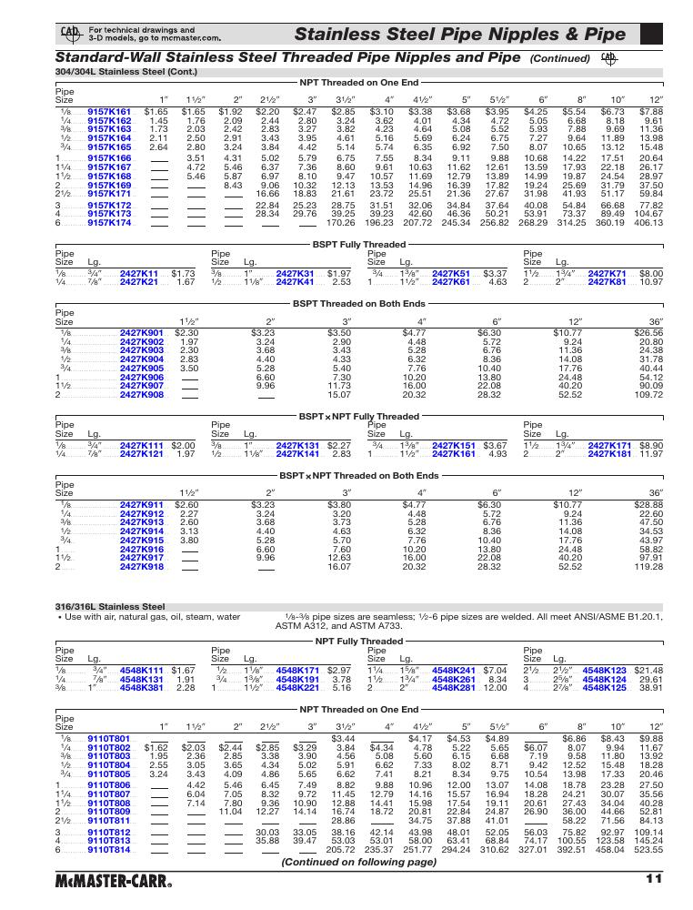
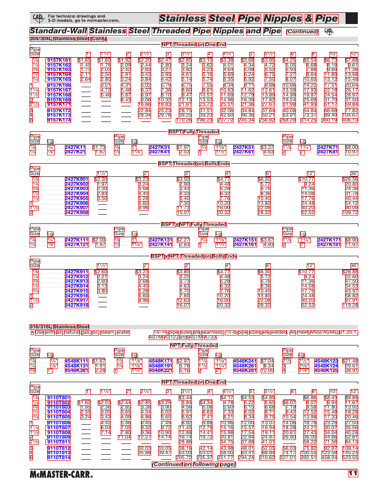

### Explanation of Catalog Data and Folder Organization
- `./_DocumentLabeler` contains the `./_DocumentLabeler/DocumentLabeler` folder for importing non-annotated (only bounding boxes and transcripts without any labels --see Table column **b** below) data directly into the DocumentLabeler tool for further processing.  
- The folder `./_DocumentLabeler/PICK` contains content processed with the PICK model. Users can utilize their own models, and we suggest incorporating their custom models into this `./_DocumentLabeler/` folder as `./_DocumentLabeler/Model_Name/.`  
- `./_images` contains the JPG images of each page with bounding box objects (e.g., words, images, etc.). _ori images are the original images, and _annoverlay images have the bounding boxes. Please note that these bounding boxes are not labeled, as seen in the sample below (see Table column **c** for their labels as default=no_label).  
- The `_images` folder also contains TXT files for each page. The structure of the text data is as follows:  
<table style="width:100%; text-align:center;">
  <tr>
    <td style="width:33.33%; text-align:center;"></td>
    <td style="width:33.33%; text-align:center;"></td>
    <td style="width:33.33%; text-align:center;"></td>
  </tr>
  <tr>
    <td style="text-align:center;"><strong>a) Original Image from pdf without a Bounding Box</strong></td>
    <td style="text-align:center;"><strong>b) Image with Bounding Boxes (no label, only transcripts)</strong></td>
    <td style="text-align:center;"><strong>c) The content of .txt files for the coordinates of the bounding boxes and transcripts</strong></td>
  </tr>
</table>

- The first column contains the transcript, and the other four numbers are the coordinates of the bounding box. The last column contains the label. In the example above, since we don't have a label yet, it is highlighted by default.  
- `./_pdfs` consists of the individual pdf pages of the catalogs in case the users would like to utilize their own tools on these pages.  

 

**❗ REMARK: ❗** The `./Shuffled` folder contains the shuffled sample data created using the entire sample catalogs with the [test_file_shuffle](../Tools/test_file_shuffle.py) script via `python test_file_shuffle.py /path/to/source /path/to/target number_of_pages`.
