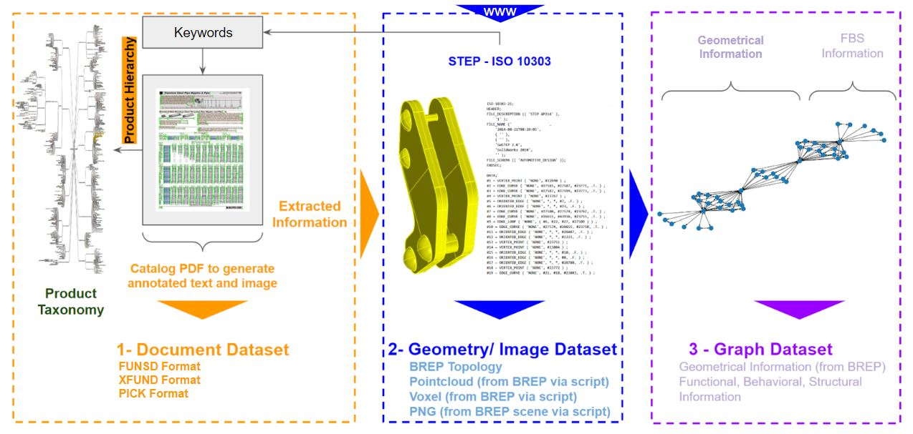
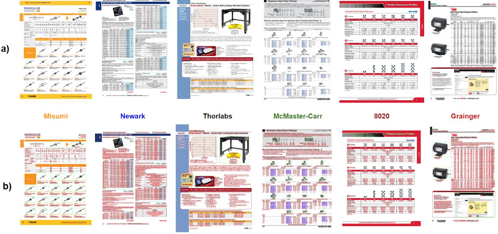

<div align="center" style="font-size: 22pt;"> 
 
 <h1 style="text-align: center;">CatalogBank 📚</h1>

[Folder Structure](#folder-structure) 📂 | [Catalogs](#catalogs) 📒 | [Geometry](#geometry) 🧊🔺🔵 | [Graphs](#graphs) 🔴➖🔴 | [Images](#images) 🖼️ | [Tools](#tools) 🛠️ |  
[Request Full Dataset Access](#request-full-dataset-access) 🔐

</div>

__Accompanying dataset to the Paper(s)__  
__Part 1-__ [CatalogBank: A Structured and Interoperable Catalog Dataset with a Semi-Automatic Annotation Tool DocumentLabeler for Engineering System Design](HTTP://www.github.com/bankh/CatalogBank)  

<div align="center">
    
    <p><strong>Figure</strong> A sample for presenting the overall architecture of the complete envisioned CatalogBank dataset.</p>
</div>

**Abstract:** In the realm of document engineering and Natural Language Processing (NLP), the integration of digitally born catalogs into product design processes presents a novel avenue for enhancing information extraction and interoperability. This paper introduces CatalogBank, a dataset developed to bridge the gap between textual descriptions and other data modalities related to engineering design catalogs. We utilized existing information extraction methodologies to extract product information from PDF-based catalogs to use in downstream tasks to generate a baseline metric. Our approach not only supports the potential automation of design workflows but also overcomes the limitations of manual data entry and non-standard metadata structures that have historically impeded the seamless integration of textual and other data modalities. Through the use of DocumentLabeler, an open-source annotation tool adapted for our dataset, we demonstrated the potential of CatalogBank in supporting diverse document-based tasks such as layout analysis and knowledge extraction. Our findings suggest that CatalogBank can contribute to document engineering and NLP by providing a robust dataset for training models capable of understanding and processing complex document formats with relatively less effort using the semi-automated annotation tool DocumentLabeler.  

__Part 2-__ 🚧 **In preparation geometry, graph, and image part of the dataset** 🚧 

__Note:__ The content relevant to DocumentLabeler is in a separate repository. Please click the [link](https://www.github.com/bankh/DocumentLabeler) to access the repository.

 ### __Folder Structure__ 📂 <a name="folder-structure"></a>
 ```
 CatalogBank/
   ├── Catalogs/
   │    ├── Samples
   │    │    ├── Thorlabs/
   │    │    │   └── OptoMechanics_v21
   │    │    │       ├── _DocumentLabeler
   │    │    │       ├── _pdfs        
   │    │    │       ├── _images
   │    │    │       └── readMe.md       
   │    │    ├── McMasterCarr/
   │    │    │   └── (SAME structure as Thorlabs/OptoMechanics_v21)
   │    │    │   
   │    │    │   ...
   │    │    │   
   │    │    └── Company X/
   │    │        └── (SAME AS Thorlabs)
   │    ├── Complete/
   │    │    └── (Require full dataset access)
   │    ├── Tools/
   │    └── readMe.md
   ├── Geometries/
   │    (Will be available in the future publications as Part 2 of CatalogBank)
   ├── Images/
   │    (Will be available in the future publications as Part 2 of CatalogBank)
   ├── Graphs/
   │    (Will be available in the future publications as Part 2 of CatalogBank)
   ├── Tools/
   │    └── readMe.md
   └── readMe.md
 ```
### __Catalogs/__: 📒 <a name="catalogs"></a>
It contains subfolders for each catalog source (e.g., Thorlabs, Grainger, Newark, Tools). Each subfolder can have its own [readMe.md](./Catalogs/readMe.md) file to describe its contents and any specifics related to that catalog.  

<div align="center">
    
    <p><strong>Figure</strong> a) Digitally-born Catalogs in PDF and b) after <a href="./Tools/1_CatalogBank_Preprocess_GenerateData.ipynb">preprocessing</a> from well-known vendors.</p>
</div>

### __Geometry/__: 🧊🔺🔵 <a name="geometry"></a>
Stores files related to geometric data. Include a [readMe.md](./Geometry/readMe.md) file to describe the types of geometries, their format, and a data library.  

### __Images/__: 🖼️ <a name="images"></a>
Contains image files. A [readMe.md](./Image/readMe.md) file explains the image data, its format, and a data library.  

### __Graphs/__: 🔴➖🔴 <a name="graphs"></a>
Stores graphical data or visualizations. The [readMe.md](./Graph/readMe.md) file details these graphs.  

### __Tools/__: 🛠️ <a name="tools"></a>
This folder contains scripts or tools for processing the data in CatalogBank. The [readMe.md](./Tools/readMe.md) file describes each tool and its purpose.  

### __readMe.md__: 
The main readMe file at the root of the repository should provide an overview of the entire CatalogBank, including a description of each subfolder and user instructions. Each main sub-folder has its readMe files to elaborate on the details of the associated folder.  

### Request Full Dataset Access 🔐 <a name="request-full-dataset-access"></a>
In this repository, the shared content is partial (10-50 pages per catalog). In order to request access to the full dataset for educational purposes ({name_lastname}@{affiliation}.edu email address is required), please fill out the following [Google Form](https://forms.gle/rQVvcgX6cjGCtcqA7).

Once your request is approved, you will receive an email with access instructions.

### Cite 📜
Please cite the respective papers if you use this dataset in your work:

__Part 1:__ [`CatalogBank: A Structured and Interoperable Catalog Dataset with a Semi-Automatic Annotation Tool DocumentLabeler for Engineering System Design`](ADD LINK OF THE PAPER HERE)  
```
@article{,
    author = {Bank, H.S. and Herber, D.R.},
    title = "{}",
    conference = {ACM Document Engineering},
    volume = {},
    number = {},
    pages = {},
    year = {2024},
    month = {August},
    issn = {},
    doi = {},
    url = {},
    eprint = {},
}
```
__Part 2:__
```
@article{,
    author = {Bank, H.S. and Herber, D.R.},
    title = "{}",
    journal = {},
    volume = {},
    number = {},
    pages = {},
    year = {},
    month = {},
    issn = {},
    doi = {},
    url = {},
    eprint = {},
}
```

